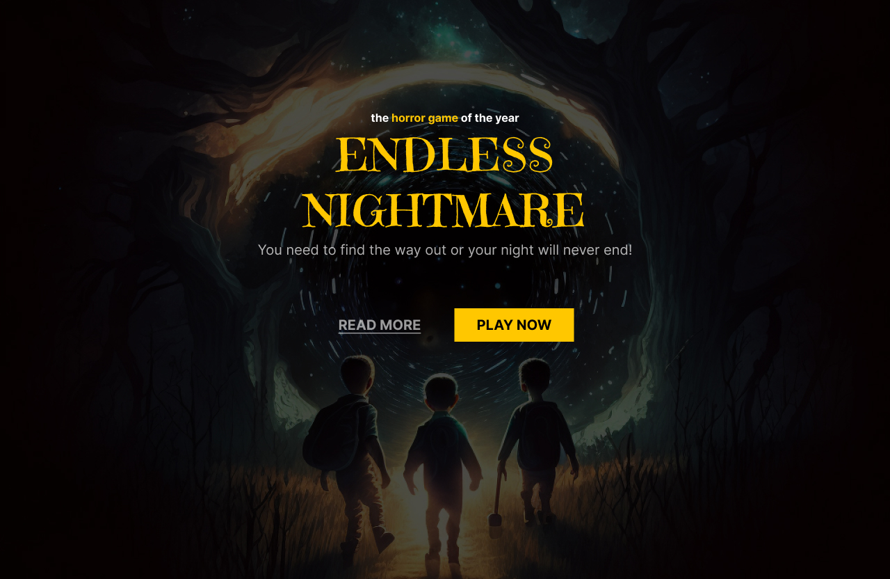

<h1> Horror Game </h1>

<h2> Os Projetos </h2>

Os projetos foram desenvolvidos durante o evento Jornada do zero à primeira vaga promovido pela Rocketseat para ensino de tecnologias WEB. 

O desafio foi a criação de uma landing page que recria a página principal de um jogo de terror fictício.

 

  

 

Quer conferir como ficou essa landing page? 

- [Visite a página online](https://eltonprado.github.io/Evento_JornadaDoZeroaPrimeiraVaga/)

 

<h2> O intuito do projeto </h2>

O intuito do projeto foi colocar em prática os conhecimentos acerca de HTML e CSS.

 

<h2> Tecnologias </h2>

Foi utilizado as seguintes tecnologias para desenvolver esse projeto:

- HTML
- CSS
- figma
- Git
- GitHub